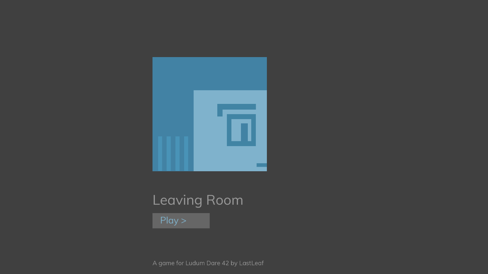
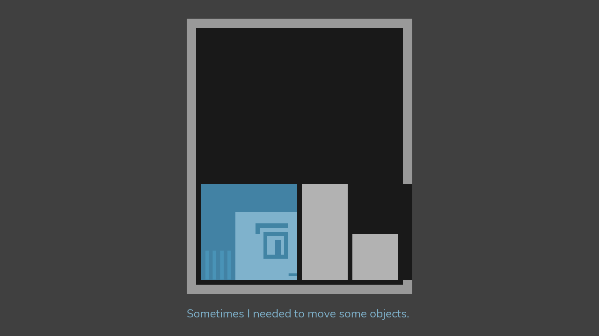
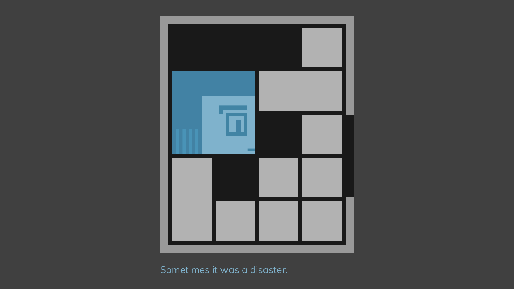
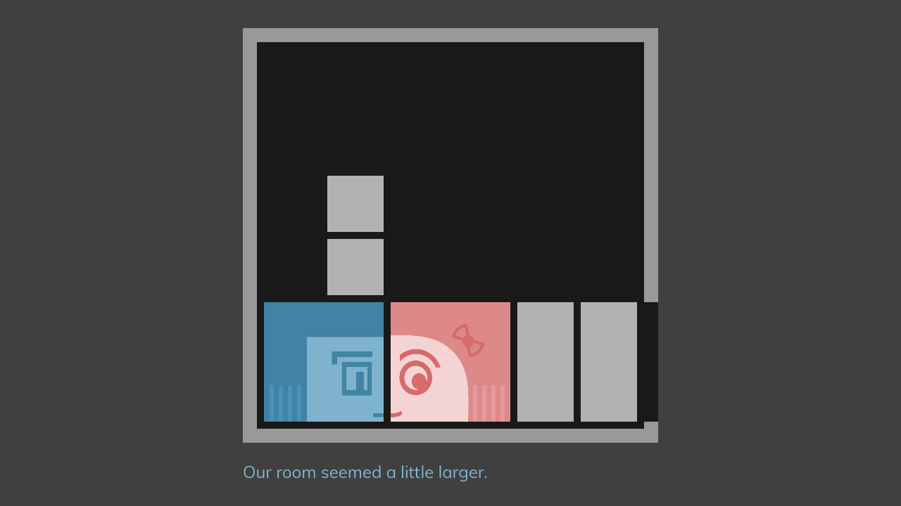

# Leaving Room

A puzzle game for [Ludum Dare 42](https://ldjam.com/events/ludum-dare/42) compo, telling a story about a room and love.

## Introduction

Control the main character to leave the room.

There are 10+ levels with puzzles, and a simple story about the room and love.

It is a small puzzle game inspired by [Klotski](https://en.wikipedia.org/wiki/Klotski). However, it is totally different from Klotski due to the gravity. Please reconsider your strategy if you ever played Klotski.

## Controls

Use mouse drag & drop to move.

Helper keys:

* Keyboard [R] to restart level;
* Keyboard [P] to go to previous level;
* Keyboard [N] to go to next level ( **CHEATING** do not do this unless you feel the puzzle is really too difficult).

## How to Play

[http://github.lastleaf.me/ludum-dare-42/](http://github.lastleaf.me/ludum-dare-42/)

This HTML5 game requires WebGL support. Please play with latest Chrome or Firefox.

Currently, touch device support is disabled.

## Screenshots

## How to Build This Game (Brief Introduction)

This game is mostly written in Rust and an unfinished framework [glayout](https://github.com/LastLeaf/glayout).

To build this game, you need

* latest Rust stable
* emscripten toolchain (for compiling Rust to JavaScript)
* node.js and npm environment

After preparing the environment, run `gulp build-debug` or `gulp build-release` to build.

## CREDIT

This game is made by LastLeaf (Fu Boquan), for Ludum Dare 42.

## LISENCE

The content of this game is under [Creative Commons Attribution-ShareAlike 4.0 International](https://creativecommons.org/licenses/by-sa/4.0/). The software of this game is under [MIT LICENSE](https://opensource.org/licenses/mit-license.html).
